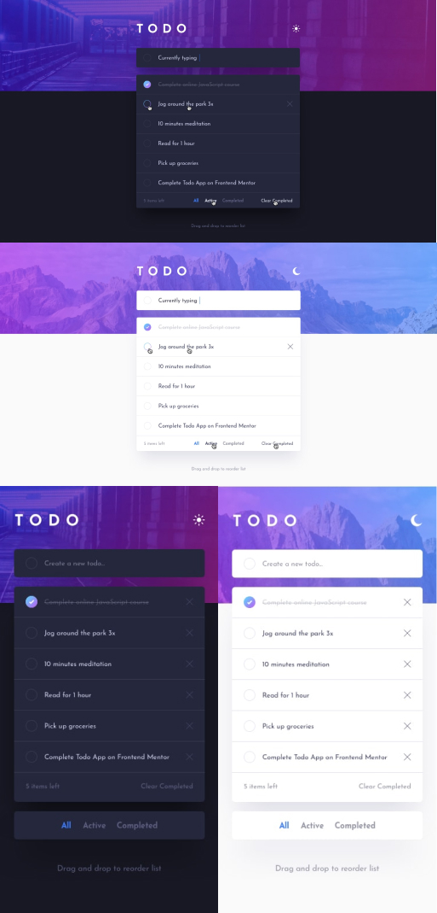

## Todo App

<br/>

#### O Projeto faz parte dos desafios do front-end-mentor

# Indice

<br/>

- <a href="#funcionalidades">Funcionalidades do projeto</a>
- <a href="#layout">Layout</a>
- <a href="#demonstração">Demonstração</a>
- <a href="#rodar">Como rodar o projeto</a>
- <a href="#tecnologias">Tecnologias utilizadas</a>

## Funcionalidades

- [x] site com propósito de armazenar as tarefas diarias a serem concluidas
- [x] site responsivo, podendo ser acessado de qualquer dispositivo.

<br/>

## Layout



<br/>

## Demonstração

[Acesse o app](https://todo-app-repository.netlify.app/)

<br/>

## Tecnologias Utilizadas

1. [React](https://react.dev/)

## Como rodar este projeto

<br/>

```bash

#clonar o repositório
$git clone linkrepo

#Acessar a pasta do projeto em seu terminal
$cd todo-app

#Instalar dependencias
$npm install

#executar a aplicação
$npm start

```

<br/>
